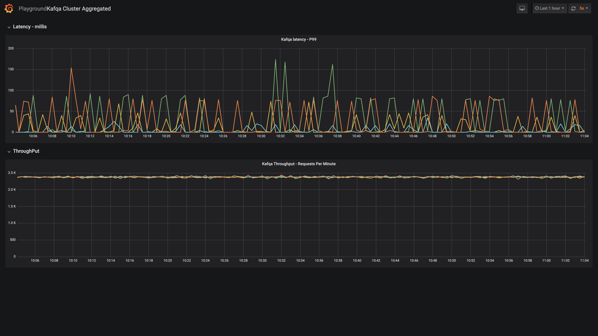

# KAFQA
[](https://travis-ci.org/gojekfarm/kafqa)
[](https://codecov.io/gh/gojekfarm/kafqa)

Kafka quality analyser, measuring data loss, ops, latency

### Features
* You can run as producer and consumer to verify kafka cluster doesn't have issues
* You can run as producer and consumer separately to another kafka cluster where data is being mirrored and verify latency
* Easy to increase throughput as it affects latency of cluster
* Consume an existing topic from kafka cluster and measure latency
* Live metrics for latencies, ack, throughput and easy to setup alerts on latency threshold breach
* Deployable with helm chart, scalable with kubernetes

### Getting Started
These instruction will help you run kafqa locally against a kafka cluster

#### Prerequisites
* running kafka cluster
* Go >= version 1.12

#### Steps
* ensure go modules is enabled GO111MODULES=on if part of GOPATH and having old go version.
* ensure kafka broker mentioned in config is up.

```
source kafkqa.env && go build && ./kafkqa
```
#### Running tests

* run `make` to run tests including linting

### Dashboard
prometheus metrics can be viewed in grafana by importing the dashboard in `scripts/dasbhoard`

The screenshot below shows setup for multiple cluster being tracked and we've alerts on that. 90,50 percentile could be added if required.

* First pane have `99 %le` e2e latency from produce till consume of a kafka message
* Second pane shows the throughput



### Report

Tool generates report which contains the following information.

* latency: average, min, max of latency (consumption till msg received)
* Total messages sent, received and lost
* App run time

```
+---+--------------------------------+--------------+
|   |          DESCRIPTION           |    VALUE     |
+---+--------------------------------+--------------+
| 1 | Messages Lost                  |        49995 |
| 2 | Messages Sent                  |        50000 |
| 3 | Messages Received              |            5 |
| 3 | Min Consumption Latency Millis |         7446 |
| 3 | Max Consumption Latency Millis |         7461 |
| 3 | App Run Time                   | 8.801455502s |
+---+--------------------------------+--------------+
```
This is a static report which helps do quick test. We also have metrics being published runtime, where we've our alerts/dashboards configured on multiple cluster.

### Data

Message format sent over kafka
```
message {
    sequence id
    id (unique) UUID
    timestamp
    random (size s/m/l)
}
```

### Running separate consumer and producers
* `CONSUMER_ENABLED, PRODUCER_ENABLED` can be set to only run specific component
* setting `PRODUCER_TOTAL_MESSAGES=-1` will produce the messages infinitely.

```
# run only consumer
CONSUMER_ENABLED="true"
PRODUCER_ENABLED="false"
```

* If you want to consume message produce in proto format from non kafqa producer
* The latency will be measured from the consumed time to the timestamp given in the proto. 

```
export PROTO_PARSER_ENABLED="true"
export PROTO_PARSER_MESSAGE_NAME="com.test.user.UserLocationLogMessage"
export PROTO_PARSER_FILE_PATH=/proto/test.proto
export PROTO_PARSER_TIMESTAMP_INDEX=3
```

* Requires `redis` store to track and ack messages
```
STORE_TYPE="redis"
STORE_REDIS_HOST="127.0.0.1:6379"
STORE_RUN_ID="run-$CONSUMER_GROUP_ID"
```

### SSL Setup
Producer and consumer supports SSL, set the following env configuration

```
CONSUMER_SECURITY_PROTOCOL="ssl"
CONSUMER_CA_LOCATION="/certs/ca/rootCA.crt" # Public root ca certificate
CONSUMER_CERTIFICATE_LOCATION="/certs/client/client.crt" # certificate signed by ICA / root CA
CONSUMER_KEY_LOCATION="/certs/client/client.key" # private key
```

### Disable consumer Auto commit
if consumer is restarted, some messages could be not tracked, as it's committed before processing.
To disable and commit after processing the messages (This increases the run time though) set `CONSUMER_ENABLE_AUTO_COMMIT="false"`

Configuration of application is customisable with `kafkq.env` eg: tweak the concurrency of producers/consumers.


### Deployment

You can install kafqa on kubernetes with [helm chart](https://github.com/gojektech/charts/tree/master/incubator/kafqa) with [sample values](https://github.com/gojektech/charts/blob/master/incubator/kafqa/values.yaml) file
```
helm install gojektech-incubator/kafqa --name kafqa-producer-001 --values=kafqa-producer.yaml
```

## Contributing
* Raise an issue to clarify scope/questions, followed by PR
* Follow go [guidelines](https://golang.org/doc/effective_go.html) for development
* Ensure `make` succeeds

## License
Licensed under the [Apache License](./LICENSE), Version 2.0
